# Luma Studio

A self-hosted AI motion-graphics and video studio. You upload a logo and brand files,
describe the film, and a director agent plans it, writes the animation, renders
previews, looks at its own frames, mixes the sound, encodes the deliverables and runs
quality checks. You watch every step as it happens: its messages, each tool call, the
terminal, the frames and the audio.

- **One command:** `docker compose up --build`, then open <http://localhost:8080>
- **Any OpenAI-compatible model** (OpenAI, OpenRouter, a local server) through the official `openai` SDK
- **Optional ElevenLabs** for voice-over with word timings, voice design, sound effects and music
- **Accounts:** simple username and password. Projects, renders and saved keys belong to
  your account and are there from any browser you sign in from
- **Bundled engine** (`luma_engine`): skia + numpy + FFmpeg, linear-light compositing,
  closed-form springs, motion blur, a sound-design synth, loudness-normalised mixing and
  a QC report. It renders a 1080p60 film with no API keys at all (the demo)

| Sign in | Director and delivered film |
| --- | --- |
| 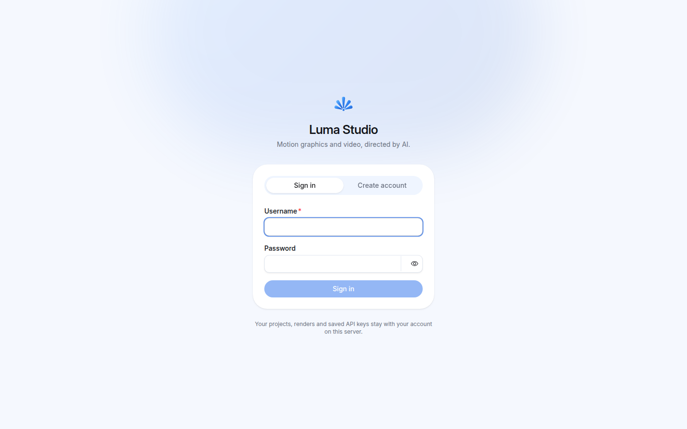 | 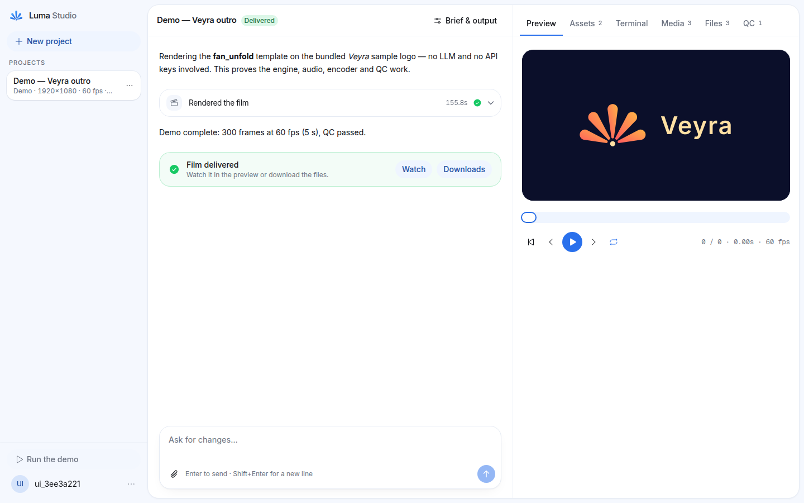 |
| **Delivered film and QC** | **Sandbox terminal** |
| 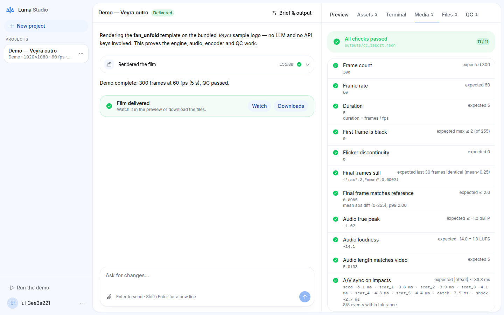 | 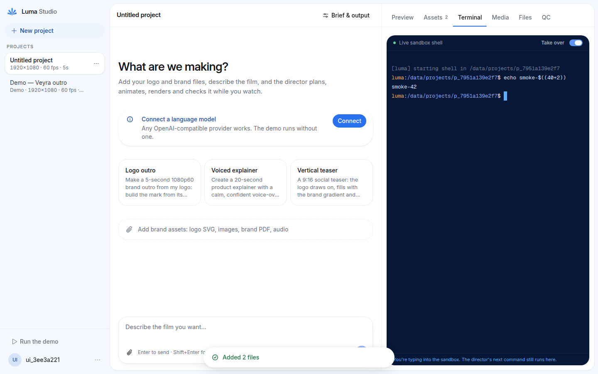 |

## Quick start

```bash
git clone <this repo> luma && cd luma
docker compose up --build        # first build takes a few minutes
open http://localhost:8080       # or just visit it in a browser
```

1. **Create an account.** The first person to open the page creates the first account
   (username 3–32 characters, password at least 8). Anyone else who can reach the port can
   also sign up until you turn sign-up off (see [Security](#security)).
2. **Run the demo** (sidebar). It needs no keys: it renders a 5-second, 300-frame 1080p60
   logo film with sound from the bundled sample mark, then checks it. It takes one to three
   minutes depending on your CPU.
3. **Connect a model** in Settings → Connections (`Ctrl`/`⌘` + `,`), then start a project,
   add your brand files and describe what you want.

Everything lives in `./data` on the host (SQLite database, encrypted saved keys, project
workspaces). Stopping or rebuilding the container keeps it.

## How the director works

Each project has a workspace (`assets/`, `work/`, `renders/`, `audio/`, `outputs/`) and a
persistent bash shell running as an unprivileged sandbox user. When you send a message:

1. The backend streams a chat completion with tools from your model. Text, reasoning,
   tool-call arguments and tool output are streamed to the page as typed events (Server-Sent
   Events, persisted in SQLite, so a reload replays the run and continues live).
2. Tools the model can call:
   - `terminal_run` / `terminal_spawn` / `terminal_poll` / `terminal_kill` / `terminal_send_keys`: the shell you see in the Terminal tab
   - `list_files`, `read_file`, `write_file`, `edit_file` (edits show as a diff)
   - `inspect_asset`, `render_preview` (contact sheet the model can see), `view_image`
   - `render_final` (a detached job with live progress), `audio_analyze`, `encode`, `qc_report`
   - `ask_user` (the run pauses and shows you options), `finish`
   - with ElevenLabs connected: `el_tts`, `el_design_voice`, `el_save_designed_voice`,
     `el_sound_effect`, `el_music`, `el_speech_to_text`, `el_list_voices`, `el_list_models`
   - planning, memory, checkpoints, presentation, approvals, production and review tools — see
     [Long jobs](#long-jobs-plan-present-collaborate)
3. Scenes are Python files that import `luma_engine`; four templates (`fan_unfold`,
   `exploded_assembly`, `stroke_reveal`, `voiced_explainer`) give the model a fast,
   well-tested starting point. The system prompt (Settings → Director) sets the workflow
   and quality bar and can be edited.
4. You can type guidance while it works (it's read before the next step), take over the
   terminal, or stop the run, which cancels the model stream, pending requests, the running
   command and render jobs.

See [ARCHITECTURE.md](ARCHITECTURE.md) and [ENGINE_NOTES.md](ENGINE_NOTES.md) for the
internals and the rendering pitfalls the engine handles.

## Long jobs: plan, present, collaborate

The director is built for long jobs (30–120 s films, many revisions, sessions that span days). It
plans, shows drafts, asks for sign-off, versions everything and delivers — like a senior studio.
Every item below is an agent tool (same registry as the others) that emits typed, persisted,
replayable events; the UI renders them live and on reload.

### Planning — `todo_write`, `todo_update`, `todo_add`, `todo_list`

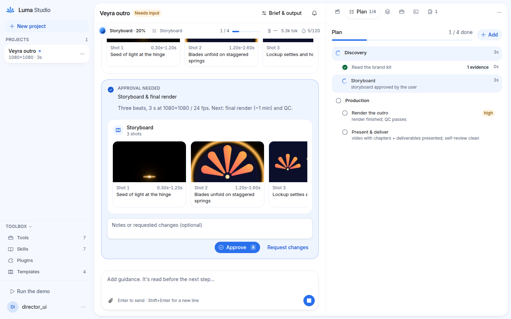

- Any request longer than ~5 steps starts with a plan: phases → tasks, each with **acceptance
  criteria**. After `plan_required_after_steps` (Settings → Limits) without a plan, only planning and
  read-only tools run.
- Exactly **one** item is in progress; `done` needs **evidence** (files, artifact ids, QC JSON) or a
  justification; `skipped` needs a reason; phases follow their tasks. Re-planning needs a reason and
  keeps the old plan as a revision.
- The plan is always pinned into the model's context (it survives compaction). The **Plan** tab and
  the sticky bar above the chat update live; you can add, edit, reorder, block, skip or complete
  items — the director gets a system note at its next step.

### Memory, notes, checkpoints, compaction, resume

| Memory | Checkpoints |
| --- | --- |
| 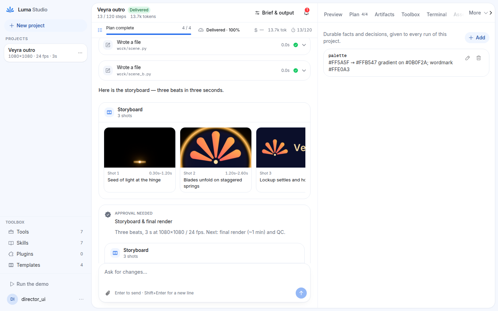 |  |

- `memory_write` / `memory_read` / `memory_search`: durable project facts (brand colours, chosen voice,
  approved style, "never use navy"), injected into every run of the project; editable in **Memory**.
- `notes_append` / `notes_read`: the director's scratchpad per run; its tail stays in context.
- `checkpoint_create` / `checkpoint_list` / `checkpoint_restore`: git snapshots of the workspace
  (scene code, audio, settings, plan) kept outside the workspace; automatic after every successful
  render; restorable (and undoable) from **Checkpoints**.
- `context_compact`: summarises older turns into a structured digest (decisions, brand facts, files,
  results, open issues); also automatic at 75 % of the context budget. The plan, memory, output
  settings, brand.json, events.json, notes and your requests are never dropped.
- **Resume**: if the container restarts mid-run, the run shows as interrupted with a **Resume** button.
  Resume closes tool calls that never returned, re-attaches jobs that are still alive, re-queues
  renders that died (finished frames are kept) and continues with a note explaining what happened.

### Presentation — the director shows its work

| Storyboard + approval | Final video with chapters |
| --- | --- |
| 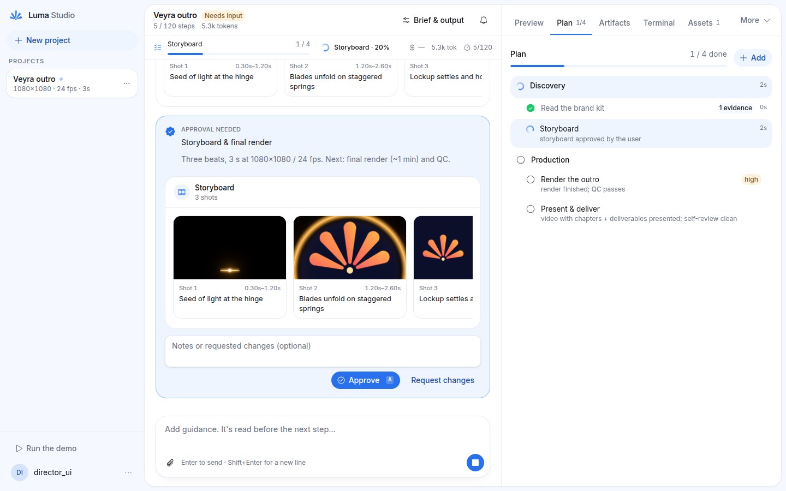 | 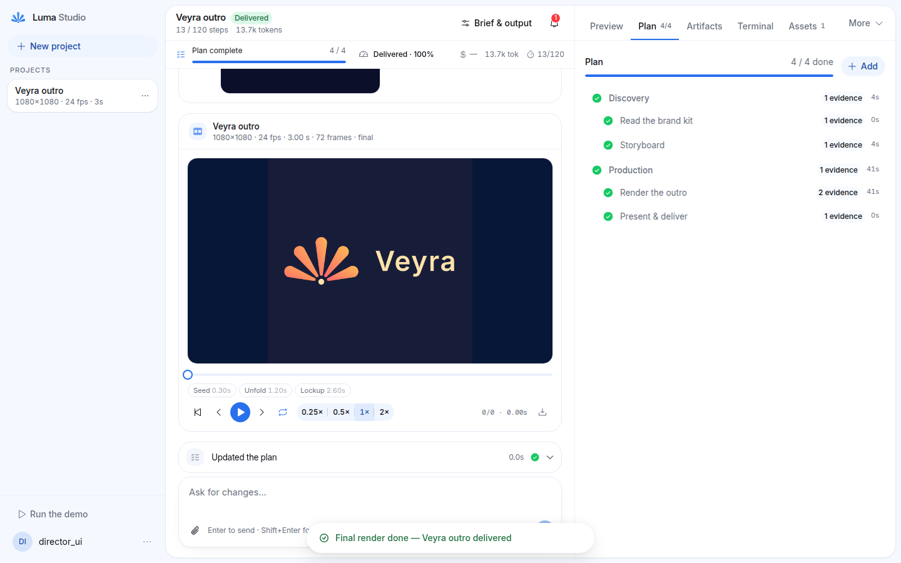 |
| **Timeline tied to the player** | **A/B compare of two versions** |
| 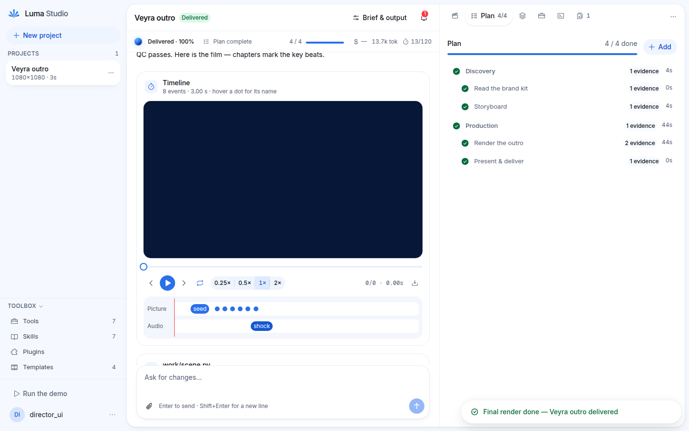 | 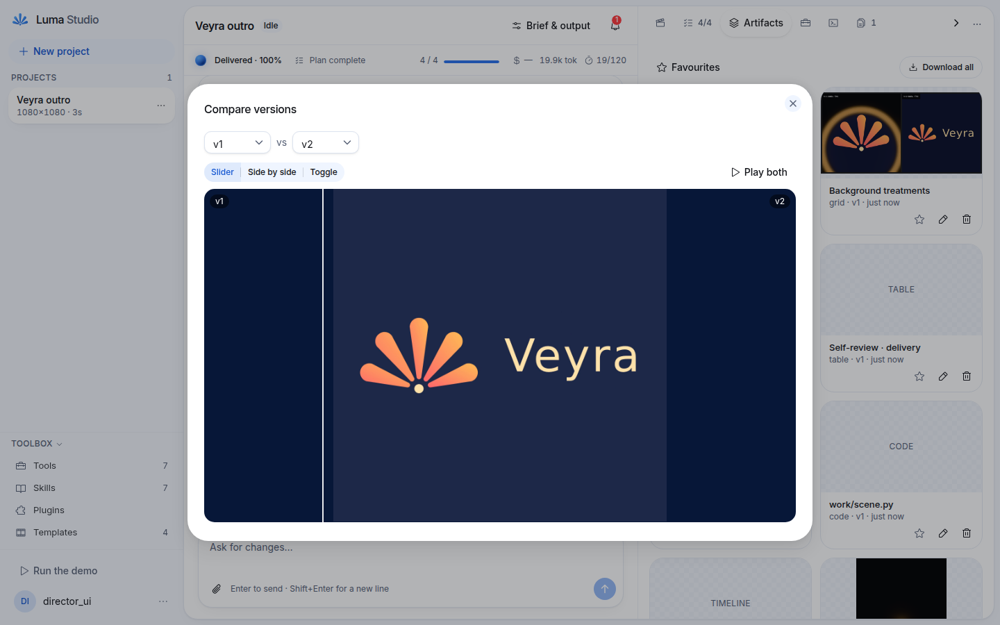 |
| **Palette** | **Code** |
| 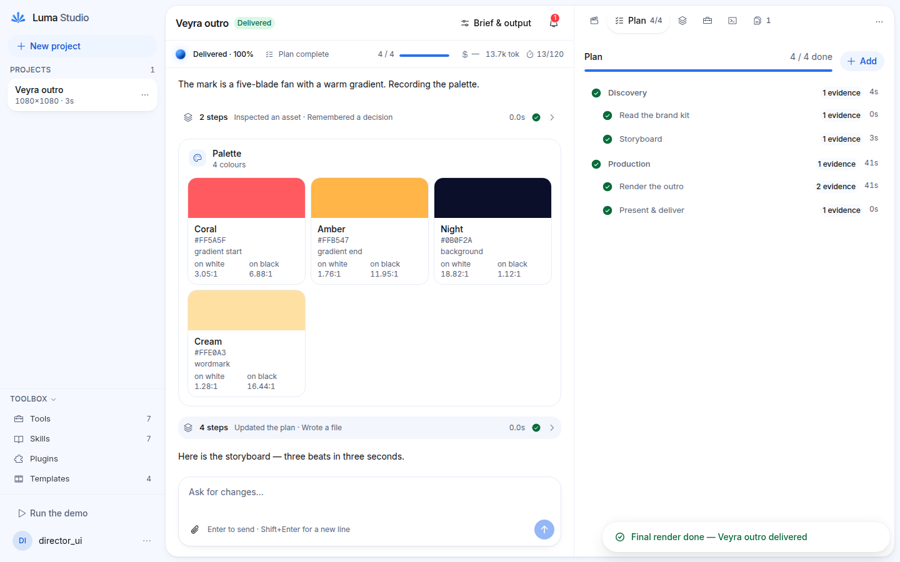 | 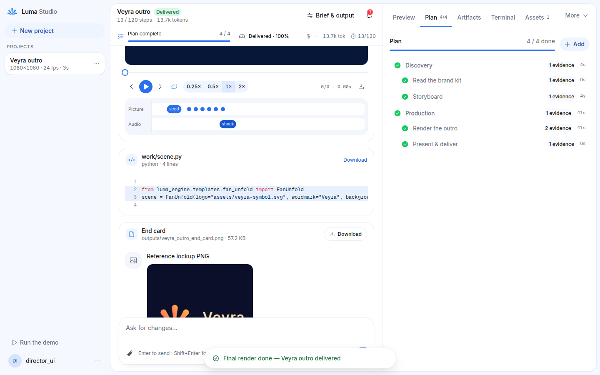 |
| **File / deliverable** | **Table (self-review)** |
| 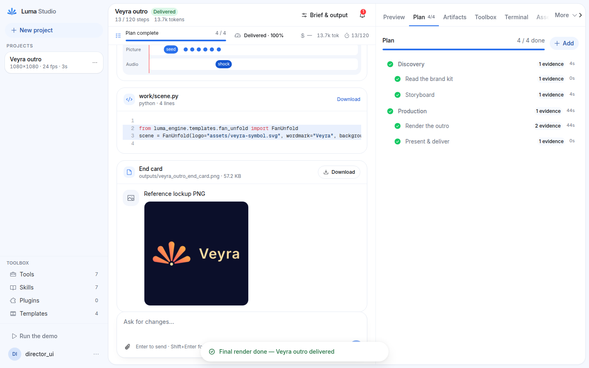 | 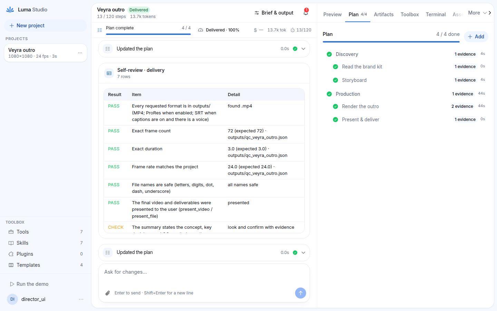 |

| Tool | Card |
| --- | --- |
| `present_video(path, title, caption?, poster_frame?, chapters?[], loop?)` | player with frame stepping (`,` `.`), speed, loop, chapter markers, download |
| `present_image(path \| paths[], title, caption?, layout=single\|grid\|carousel)` | stills, end cards, contact sheets |
| `present_audio(path, title, transcript?, waveform=true)` | waveform player; word timings highlight during playback |
| `present_file(path, title, description?)` | download card with type icon, size and a preview (text, code, JSON, SRT, PDF, zip listing, media) |
| `present_comparison(a, b, mode=side_by_side\|slider\|toggle, labels)` | A/B of two videos (synced) or images |
| `present_storyboard(frames[] or scene_path, timings[], notes[])` | shot strip rendered from the scene, for sign-off before the final render |
| `present_timeline(events[] or events_path, video?)` | picture/audio event tracks with a scrubber tied to the player |
| `present_code(path, highlight_lines?)` | syntax-highlighted scene code |
| `present_table(title, columns, rows)` | specs, palettes, QC results |
| `present_palette(colors[{hex,name,usage}])` | brand swatches with contrast ratios |

Everything presented becomes an **artifact** — pinned to the **Artifacts** shelf, **versioned** by
`version_group` (v2, v3…), comparable (pick any two versions), and can be favourited ⭐, renamed,
deleted, downloaded, or downloaded all at once as a zip.

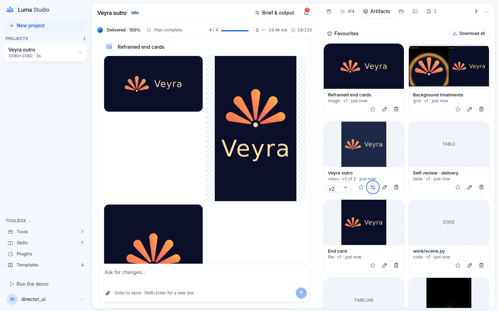

### Collaboration & approval

- `ask_user(question, options?, allow_free_text, multi_select, timeout_s?, default?)`: chips + text box;
  the run pauses until you answer (or the timeout picks the default). Typing in the composer answers too.
- `request_approval(title, summary, artifacts[], choices)`: a sign-off gate with the drafts attached.
  Enforced in code before expensive steps — 4K or long (estimated) final renders, long ElevenLabs
  generations, continuing past the run's cost or time thresholds — unless **Autopilot** is on
  (**Brief & output → Collaboration**, where the thresholds live). Press **A** to approve.
- `present_options(title, options[{label, description, preview_artifact}])`: "here are 3 directions".
- `notify(message, level)`: toast + desktop notification + the bell's history.
- `report_progress(stage, percent, eta_s?, detail?)`: the stage shown in the sticky bar.

| Collaboration settings | Notifications |
| --- | --- |
| 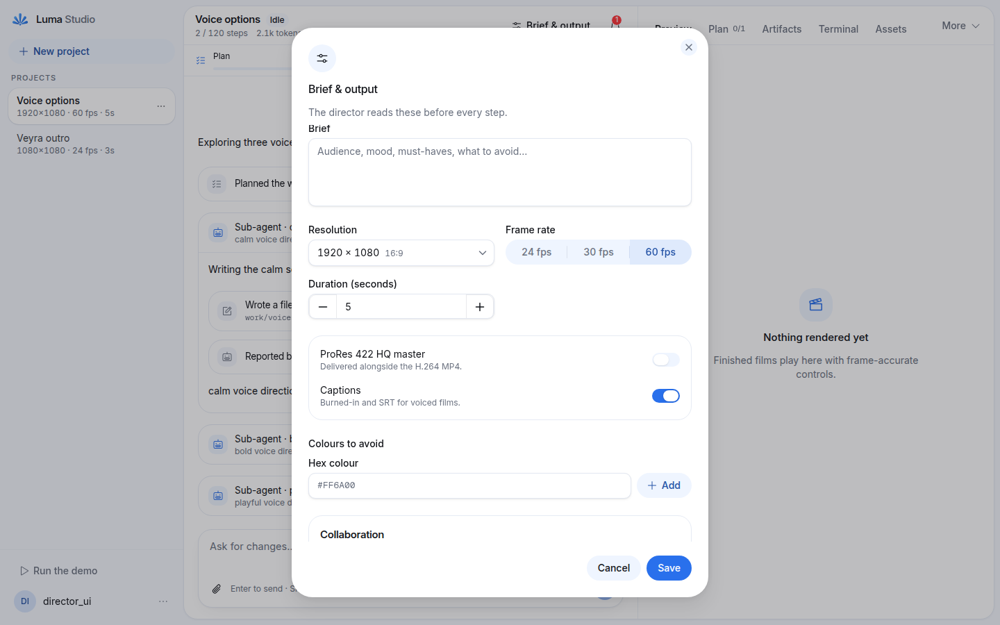 | 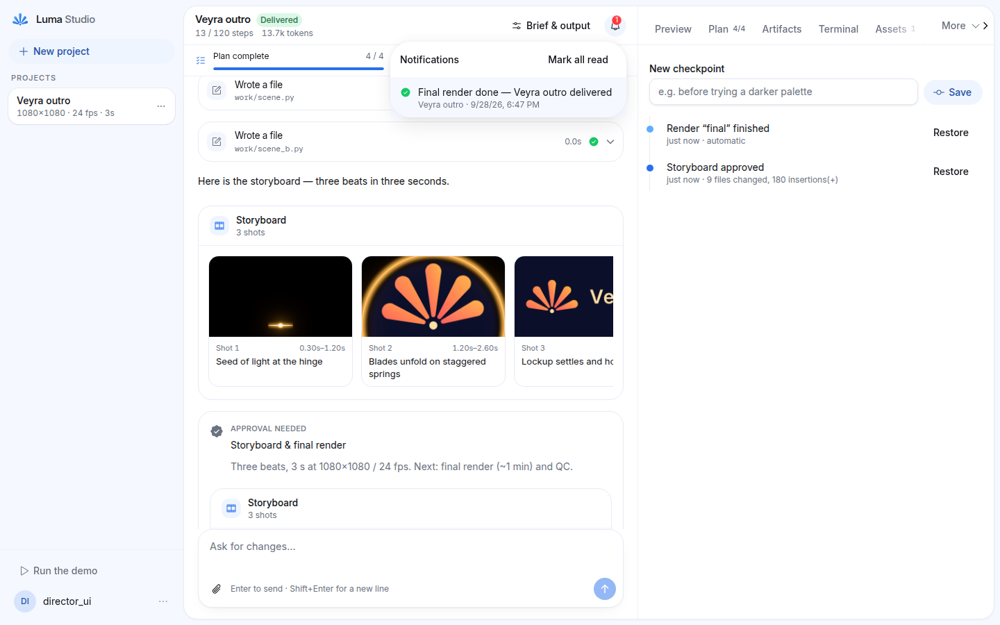 |

### Production power tools (also on the CLI: `python -m luma_engine <cmd>`)

| Variants grid (`batch_render`) | Reframed end cards (`reframe_export`) |
| --- | --- |
| 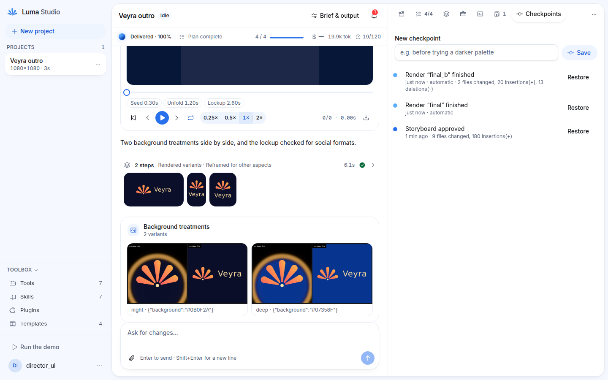 | 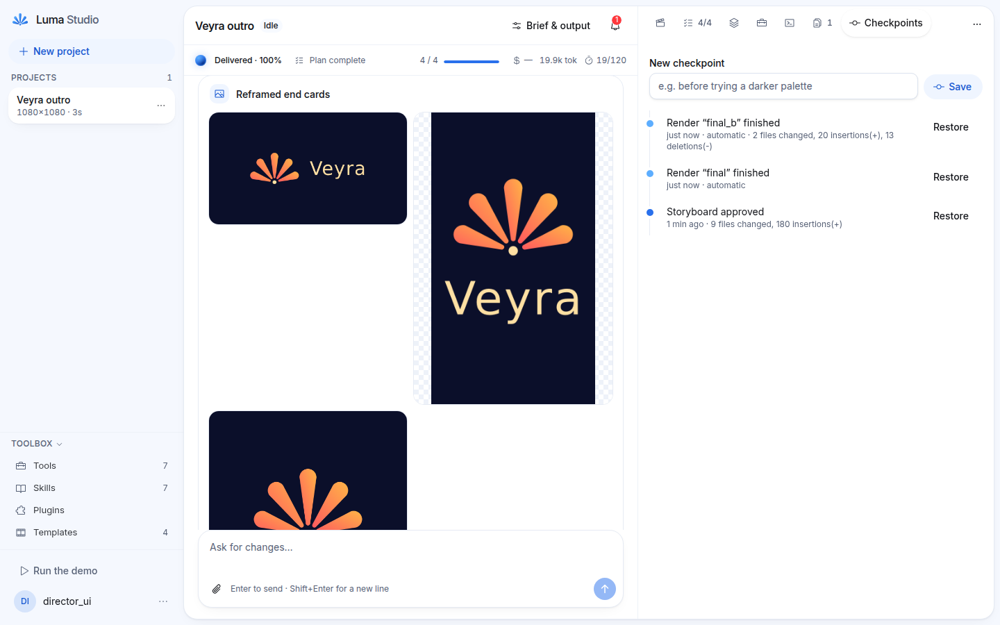 |

| Tool | CLI | What it does |
| --- | --- | --- |
| `media_probe(path)` | `probe` | ffprobe as clean JSON |
| `extract_frames(path, times[] \| every_n)` | `frames` | PNG frames + a labelled contact sheet |
| `make_gif_or_webp(path, start, end, width, fps)` | `gif` | palette-optimised GIF / animated WebP previews |
| `make_thumbnail(path, time)` | `thumb` | a still from a video |
| `export_end_card(scene, time, sizes[])` | `endcard` | the final design rendered (not scaled) at each size |
| `reframe_export(scene, aspect_ratios[])` | `reframe-check` | re-renders the same scene for 16:9, 9:16, 1:1, 4:5 — the lockup re-lays out (horizontal/stacked, title-safe), no cropping |
| `batch_render(scene, variants[])` | `--set key=value` | parameter sweeps as queued jobs, presented as a comparison grid |
| `vectorize_raster(path)` | `vectorize` | PNG/JPG logo → SVG (vtracer) with an IoU fidelity score; always flagged as auto-traced |
| `extract_palette(path)` / `detect_fonts(path)` | `palette` / `fonts` | dominant + declared colours; exact PDF font names, OCR-assisted guesses marked as guesses |
| `install_font(family \| url)` | — | Google Fonts / official releases into `fonts/`, licence recorded |
| `audio_mix(tracks[], target_lufs)` | `mix` | multitrack mix, side-chain ducking, loudness + true-peak limiting |
| `captions_build(word_timings, style)` | `captions` | SRT, WebVTT and a kinetic-caption layer spec |
| `render_queue_status()` / `render_queue_cancel(job_id)` | — | every spawned job across your projects |
| `budget_status()` | — | tokens + estimated cost (OpenRouter pricing), ElevenLabs characters, time, steps left — also the live meter in the sticky bar; cost/token caps stop runs gracefully |
| `web_fetch(url)` / `web_search(query)` | — | off by default (per project); results are shown as source cards and treated as untrusted data |

### Self-review & quality gates

- `self_review(checklist_name)` runs `prompts/checklists/{brand_fidelity,motion_quality,audio_quality,delivery}.md`
  against the output and returns a pass/fail table (measured items + items the director must confirm).
- Failing `qc_report` checks become **blocked** plan items; they close themselves when QC passes.
- `finish` refuses while plan items are open, QC fails, or the final video / deliverables were not
  presented with `present_video` / `present_file`.

### Sub-agents — `spawn_subagent(task, tools_allowed[], budget)`

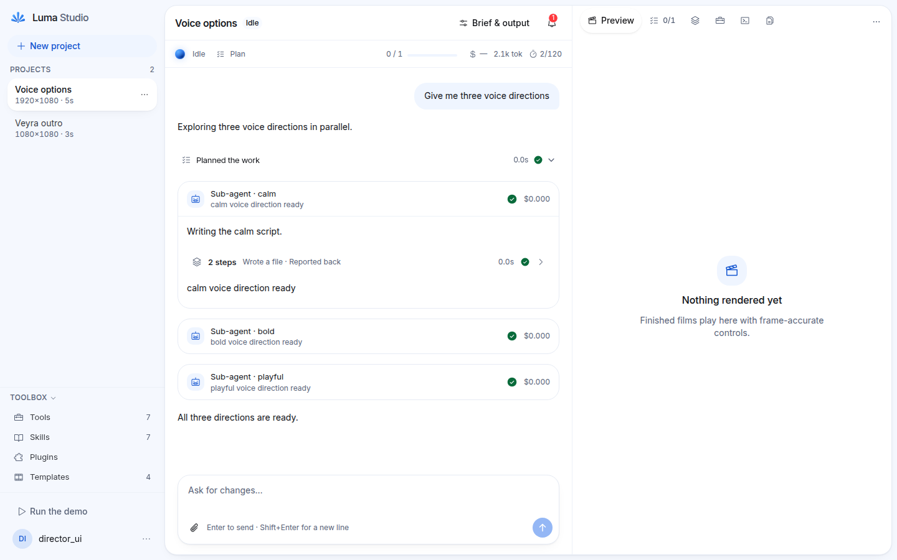

Optional (per project). A child agent with its own context, a restricted toolset and its own step /
cost / ElevenLabs budget works on a self-contained task ("design 3 voice options") and reports a
structured result. Children run in parallel up to the project's limit, their cost counts against
the parent, they are cancelled with it, and their timelines nest under the parent's.

### Keyboard

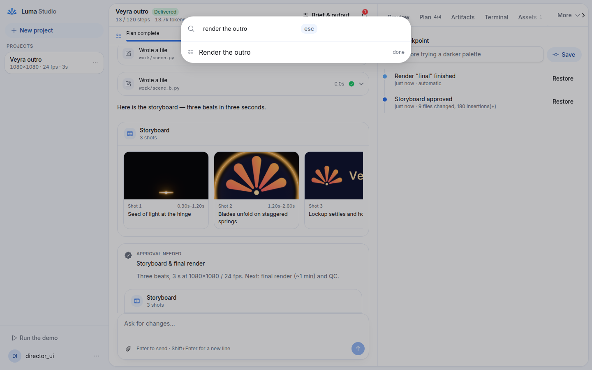

| Key | Action |
| --- | --- |
| `Space` / `k` | play / pause the focused player |
| `,` / `.` | previous / next frame |
| `A` | approve the pending approval |
| `Esc` | stop the run (asks to confirm) |
| `Ctrl`/`⌘` `K` | command palette: jump to a project, artifact or todo; start the demo; export all |
| `Ctrl`/`⌘` `,` | settings |

## Toolbox: the director builds its own tools

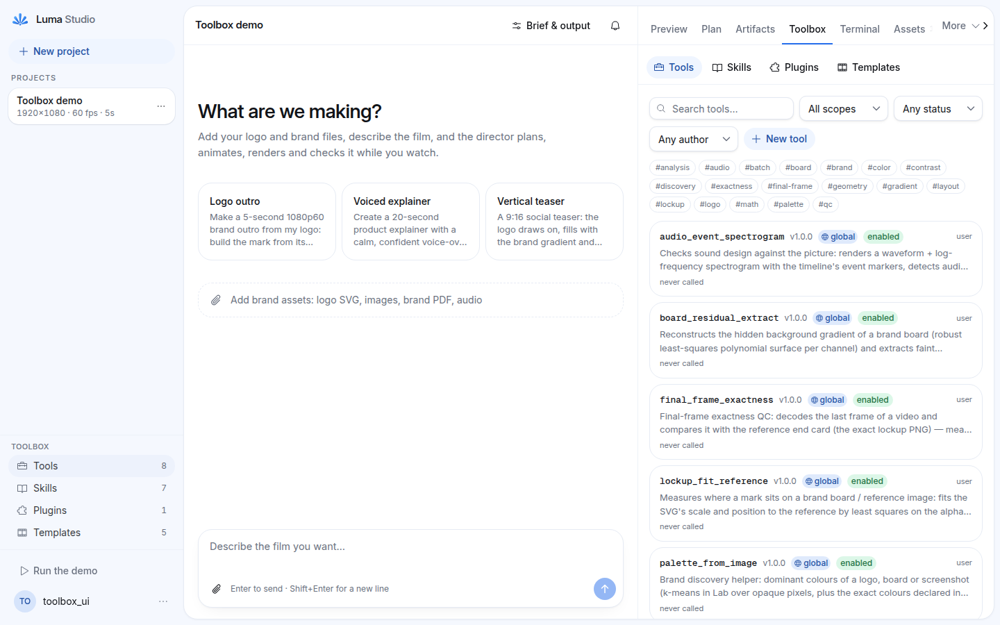

While it works, the director grows a personal toolkit, like an expert engineer: quick scripts for exploration,
**tools** (tested, versioned, callable like any built-in tool) for the code worth keeping, **engine plugins** (new
effects, instruments, QC checks), **templates** made from successful scenes, and **skills** — written playbooks of
how it solved hard problems, so later runs start from them.

Everything lives in `/data` and survives `docker compose up --build`:

```
/data/toolbox/                  GLOBAL (every project), a git repo — tools/<name>@<version> are tags
  tools/<name>/                 tool.yaml · main.py · test_tool.py · README.md · fixtures/ (≤ 2 MB)
  skills/<name>/SKILL.md        playbooks
  plugins/<name>/ registry.json luma_engine extensions (fx · template · instrument · qc_check)
  requirements.lock             pinned union of every tool dependency
/data/projects/<id>/work/
  scripts/                      one-off scripts (the default place for new code)
  tools/<name>/                 project tools (override a global tool of the same name)
/data/venv/                     persistent Python venv for tool dependencies (layered over the image's)
/data/opt/bin/                  downloaded binaries (on the sandbox PATH)
```

Project `tools/` and `scripts/` are versioned in a repository kept **outside** the workspace (`/data/git/<id>.work`),
so the agent's shell can neither rewrite nor corrupt the history. On boot the studio checks `/data/venv` against
the lock file and reinstalls anything missing (logged; Toolbox → summary shows it).

### The lifecycle

```
toolbox_search("measure the lockup gap on a board")      # 1. reuse before build (also skill_search)
script_write("measure_gap.py", …) → script_run(…)         # 2. explore in work/scripts/
tool_create(name, manifest, main_py, test_py, readme)     # 3. manifest + tests + README; ruff; deps → /data/venv; tests run
tool_test(name)                                           # 4. pytest in the sandbox
tool_register(name)                                       # 5. callable as `name` from the next step (and in future runs)
measure_lockup_gap(board="assets/board.png")              # 6. a first-class tool (or toolbox_call)
tool_update(name, main_py=…, reason=…, bump="minor")      # 7. new version; re-tested, re-registered; old versions tagged
tool_promote(name, reason=…)                              # 8. project → global, after the user approves the diff
skill_write(name, SKILL.md)                               # 9. record the lesson
```

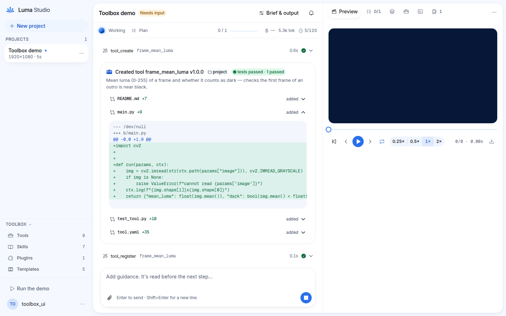

The timeline shows each step: a **tool_create** card with the new files as diffs and the test results, a
**🧰 New tool available** badge after `tool_register`, and **promotion requests as approval cards with the diff, the
tests and the README**:

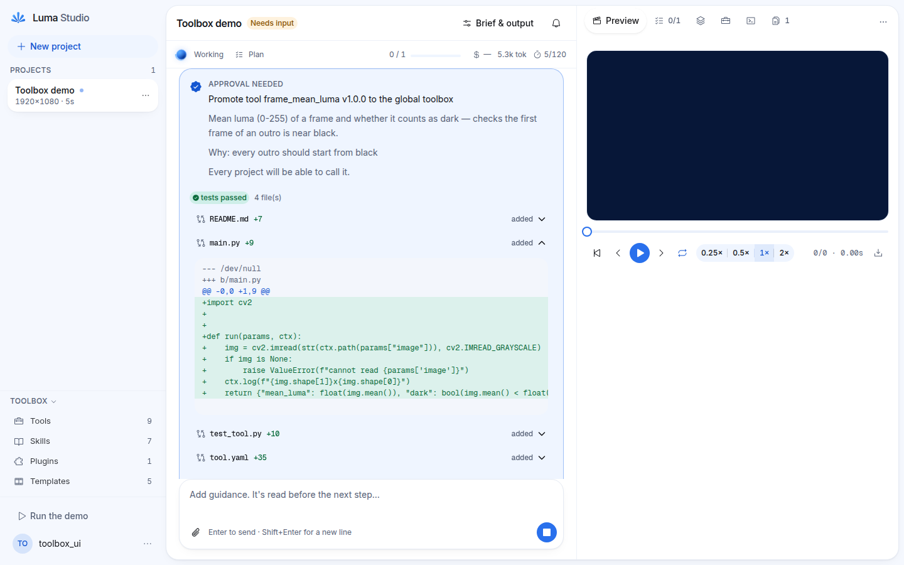

### Tool manifest (`tool.yaml`) and runtime

```yaml
name: fit_lockup_to_reference         # snake_case, unique within its scope; never a built-in name
version: 1.2.0                        # semver; tool_update bumps it
scope: global | project
description: >                        # what the model reads: 1–3 precise sentences
  Fits icon+wordmark placement to a reference image by least squares…
parameters: {type: object, properties: {reference: {type: string}}, required: [reference]}   # JSON Schema 2020-12
returns: {type: object}               # the result is validated against it
dependencies: [numpy==2.1.*]          # pinned (==); installed into /data/venv, recorded in requirements.lock
timeout_s: 300
resources: {max_memory_mb: 2048}
network: false                        # true only works while Settings → "Toolbox tools may use the network" is on
produces_files: true
tags: [layout, brand]
author: agent | user
created_from_run: r_…
```

`main.py` exposes `run(params, ctx) -> dict`. `ctx` gives `workspace`, `out_dir`, `out(name)` (a file in out_dir),
`path(p)` (a workspace path, confined), `log(msg)`, `progress(pct, msg)`, `emit_image(path)`, `cancelled()` and
`call_tool(name, params)` — an RPC back to the studio for ElevenLabs tools, other toolbox tools and a few read-only
built-ins, **through the same budgets and approval gates as the agent's own calls** (tools never see API keys).
Tests use `from luma_engine.toolkit import make_test_ctx` (fake `call_tool` handlers included).

Tools run as `python -m luma_engine.toolkit` in the sandbox — same user, limits and scrubbed environment as the
terminal: params on stdin, JSON lines back (logs and progress stream into the tool card). Params and results are
checked against the schemas; a bad call gets a precise error, a crash / timeout / memory blow-up is an error result,
never a backend problem.

### Registry, ranking and health

The model sees the built-in tools **plus at most N toolbox tools per step** (Settings → *Toolbox tools per step*,
default 15): the ones registered or used in this run, the most relevant to the current todo (SQLite FTS5 over names,
descriptions, READMEs and tags), then the most used. Every registered tool stays callable by name or `toolbox_call`,
and discoverable with `toolbox_search`. Only enabled tools whose tests passed **on the current files** are offered —
editing a registered tool by hand marks it *modified* until it is re-tested. Per tool the studio tracks calls,
success rate, average duration, the last error and the runs that used it. **A tool that fails 3 times in a row is
disabled**, a blocked "Fix tool X" todo (with the failing traces) is added to the plan and you get a notification.

### Skills

`SKILL.md` = front-matter (`name`, `description` = when to use it, `tags`, `tools_used`, `created_from_run`) and the
sections **When to use · Steps · Pitfalls · Verification · Example**. At the start of every run the skills most
relevant to the brief, the assets and the request are summarised into the director's context; it reads the full
text with `skill_read`. After a hard run (many steps, repeated tool rewrites, a tool that broke), `finish` asks for a
new or updated skill. Seeded skills: `brand_discovery`, `logo_split_exact`, `lockup_fit_from_board`,
`hidden_board_elements_extraction`, `motion_blur_and_hdr_compositing`, `sound_design_event_sync`,
`final_frame_exactness_qc`.

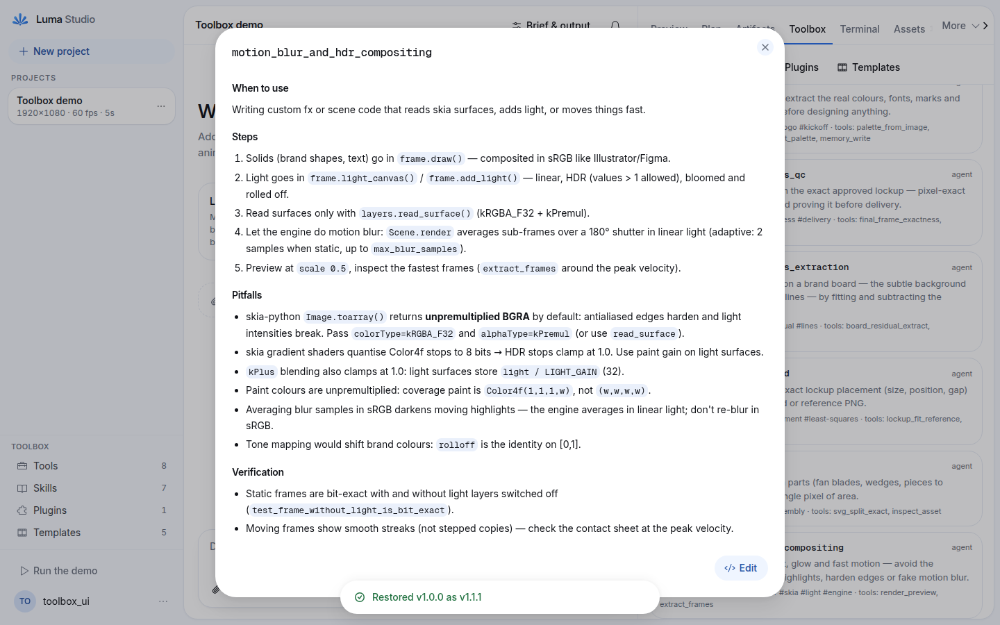

### Seeded tools

Ported from engine utilities, each with tests — tested and registered at first boot:

| Tool | What it does |
| --- | --- |
| `svg_split_exact` | Split a logo shape at its pivot / along lines with an exact area check (< 1e-9) |
| `lockup_fit_reference` | Measure a mark's placement on a board by least squares |
| `board_residual_extract` | Reconstruct a board's hidden gradient; extract faint lines by residual subtraction |
| `audio_event_spectrogram` | Spectrogram with event markers + per-event onset offsets (sync check) |
| `reframe_safe_areas` | Batch 9:16 / 1:1 / 4:5 end-card check against the safe areas |
| `palette_from_image` | Palette with shares and WCAG contrast pairs |
| `final_frame_exactness` | Last frame vs the reference end card: MAD, max, heatmap |

### Plugins and templates

`plugin_create(kind="fx|instrument|qc_check", name, code, tests)` adds an engine extension under
`toolbox/plugins/`; once its tests pass it is enabled in `registry.json` and scene code can
`from luma_engine.plugins import <name>` (QC-check plugins run inside every `qc_report`).
`template_save(name, scene_path, params_schema, preview_video)` turns a successful scene into a template plugin with
its brand-specific values (logo, colours, fonts, wordmark, timings) as parameters, bundled assets, a thumbnail and a
preview. The **Templates** gallery (left nav) starts a new project from one: its assets are copied and
`work/scene.py` builds the template with editable `PARAMS`.

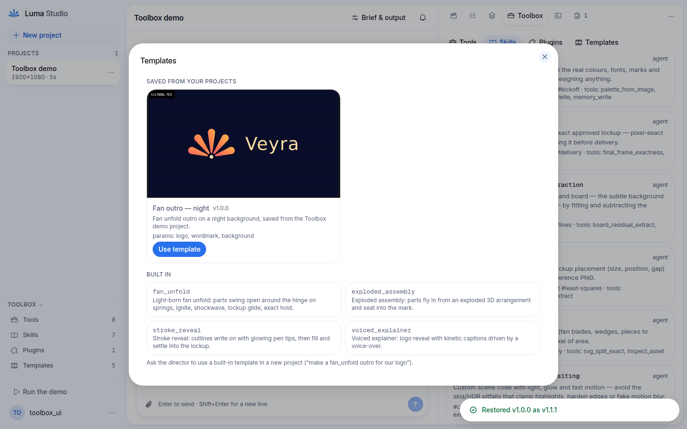

### The Toolbox UI

**Toolbox** in the left nav (tools, skills, plugins, templates with counts) and as a right-pane tab. Tools can be
filtered by tags, author (agent/user), status (enabled / disabled / failing / modified / deprecated) and scope. The
tool detail shows the manifest, the rendered README, the source and tests (with **Run tests**), usage stats and recent
calls (linked to their runs), the **version history with diffs and revert**, and enable/disable, promote and delete.
**Try it** is a form generated from the tool's JSON Schema that runs the tool in the current project and shows the
result, images and logs. You can author tools and skills by hand too — same validation, tests and scan, marked
`author: user`.

| Detail | Try it | History |
| --- | --- | --- |
| 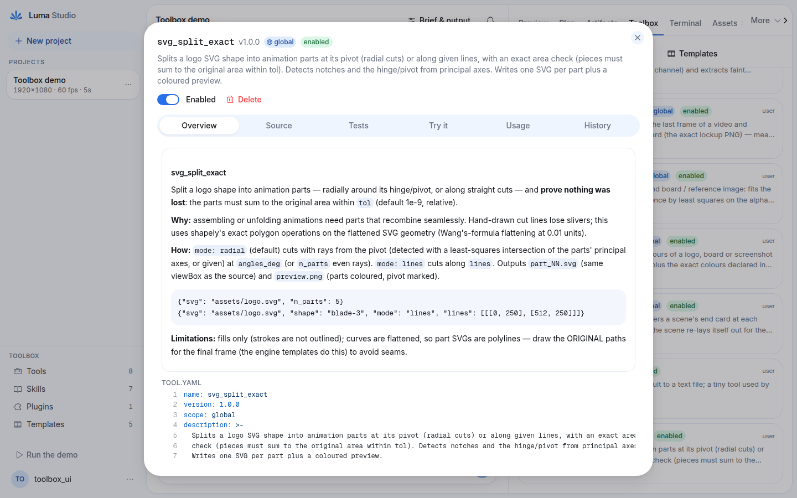 | 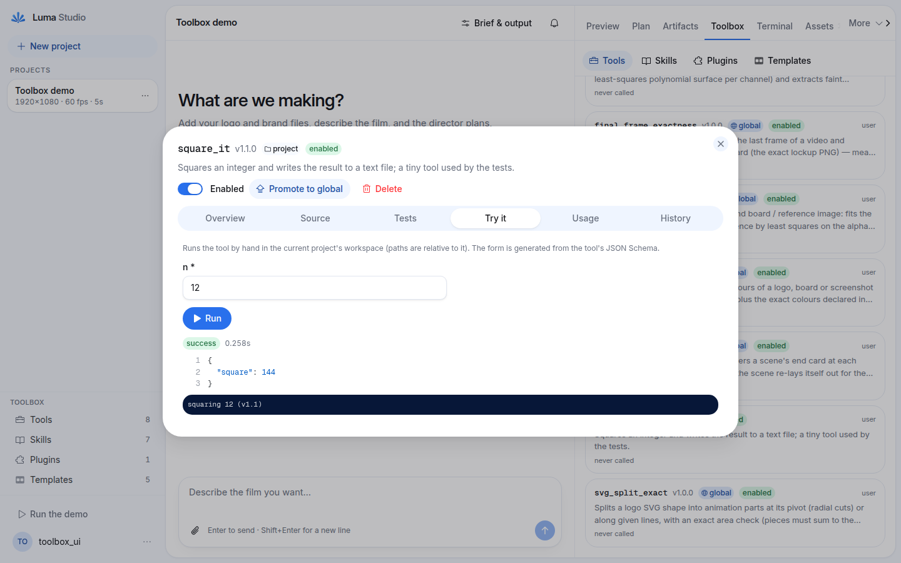 | 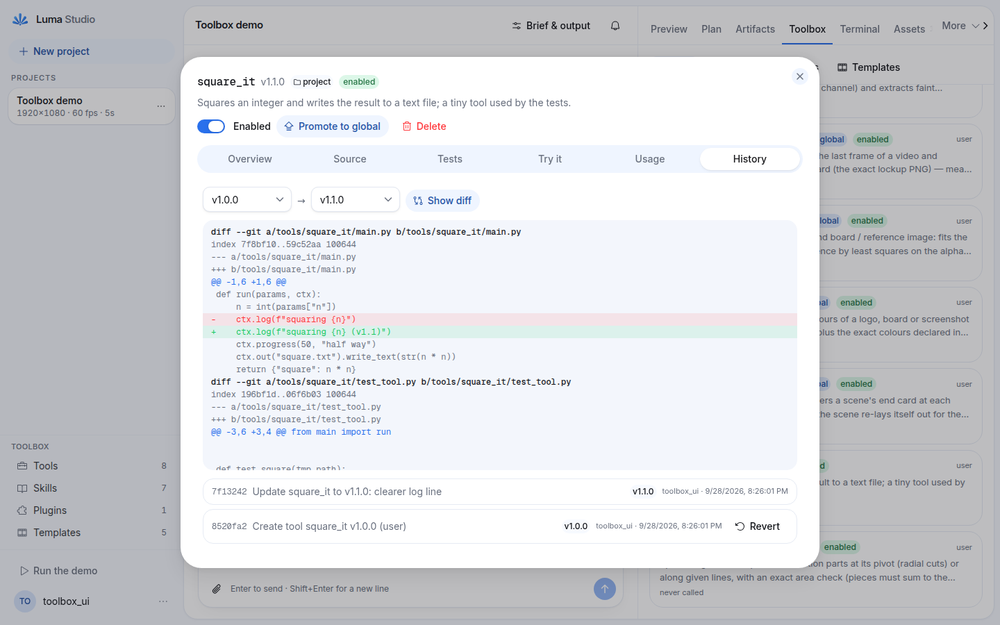 |

### Safety rules for agent-written code

- Tools run with **exactly the terminal's sandbox rights** (same non-root user, limits and scrubbed environment) —
  plus: a `network: false` tool runs with the primary group `lumanonet`, whose sockets the container firewall rejects
  (kernel-enforced, so even a `curl` subprocess is blocked); in-process guards refuse writes outside the workspace /
  `out_dir` / temp dir, reads of process environments, Luma's secrets / database / git repos, raw sockets and `sudo`.
- **Static checks before registering**: ruff (syntax errors and undefined names block), blocked patterns
  (`/proc/*/environ`, the Docker socket, `/data/secrets`, raw sockets, `sudo`, API keys read from the environment,
  network imports when `network: false`), secret detection, file-size limits, no symlinks.
- **Promotion to global** additionally blocks project-specific values — absolute or project paths, project ids, the
  project's asset names, brand colours and names — and asks the agent to parameterise them; the user approves the
  diff unless *Autopilot* **and** *Autopilot may promote tools to global* are both on. Deleting a global tool needs
  approval too.
- The global toolbox is written only by the backend (read-only for the sandbox). Every change is a git commit, and
  every global change has an audit-log entry (who / what / when / run): `GET /api/toolbox/audit`.
- A crash in a tool never crashes the backend. With `LUMA_SANDBOX_SUDO=1` (the default) sandbox code can still
  escalate *inside the container* — the container remains the security boundary; set it to `0` for a hardened setup.

## Connecting a model

Settings → Connections → Language model. Pick a preset or enter any OpenAI-compatible base URL:

| Provider | Base URL | Notes |
| --- | --- | --- |
| OpenRouter | `https://openrouter.ai/api/v1` | One key for many models. "Load models" lists them and marks which support tools and vision. |
| OpenAI | `https://api.openai.com/v1` | |
| Local (Ollama, LM Studio, vLLM…) | e.g. `http://host.docker.internal:11434/v1` | Needs a model with reliable streaming tool calls. |

**Test & save** checks authentication, streaming, tool calling and (optionally) vision.
The model must support tool calling; vision lets it look at its own preview frames and is
strongly recommended.

**Where keys go.** With *Save to my account* on (the default) the key is encrypted on the
server (Fernet, key file in `data/secrets/`) and follows your account to any browser. Turn
it off to keep the key only in this browser's localStorage; it is then sent with each
request. Keys are never written to logs or run events, and never enter the agent's
terminal environment: the model reaches ElevenLabs only through the backend tools, and
known key patterns are redacted from terminal output. You can also set `LLM_API_KEY`,
`LLM_BASE_URL`, `LLM_MODEL` and `ELEVENLABS_API_KEY` in the environment as a server-wide
fallback (shared by every account).

## ElevenLabs (optional)

Settings → Connections → ElevenLabs. The test shows your plan's character usage and which
features your key can use (text to speech, voice design, sound effects, music, speech to
text). Generated audio is cached by content hash, so re-running with the same text costs
nothing, and a per-run character budget (Settings → Limits, default 5,000) is checked before
every request.

## Costs

- **Model tokens:** a typical film takes 20–80 tool steps. Token use is shown live under
  the project title. Previews are sent to the model as images, which is the main cost with
  vision models. Pick a cheaper model for iteration and set *Max tool steps* and the time
  limit in Settings → Limits.
- **ElevenLabs:** billed per character for speech and per generation for sound effects and
  music. The run's character count is shown next to the token count.
- **Rendering** is local CPU time. A 5 s 1080p60 film renders in 1–3 minutes on a
  4-core machine; the compose file limits the container to 4 CPUs and 8 GB (`LUMA_CPUS`,
  `LUMA_MEMORY`).

## Security

- **Every account gets a shell** inside the container (as the unprivileged `luma` user,
  with passwordless `sudo` *inside* the container so installs work) and can spend the API
  credits saved to it. Treat accounts like SSH access to the container.
- The port is bound to **127.0.0.1** by default. The first visitor creates the first
  account, so sign up before exposing it anywhere.
- To expose it: put it behind TLS (a reverse proxy such as Caddy or nginx), set
  `LUMA_ALLOWED_HOSTS=studio.example.com`, and set `LUMA_ALLOW_SIGNUP=false` once your
  accounts exist. The session cookie is `HttpOnly`, `SameSite=Lax`, and `Secure` behind HTTPS.
- **The container is the sandbox.** It is not privileged, has no Docker socket, only
  `./data` is mounted, capabilities are dropped to what the sandbox needs, and CPU, memory
  and process counts are limited. The agent's shell cannot read the database or the key
  store, cannot reach Luma's own API port, and has network access only while *Terminal
  network access* is on (Settings → Limits; enforced with iptables inside the container).
- Other hardening: host allow-list (DNS rebinding), a custom header required on every
  state-changing request (CSRF), Origin checks on the terminal WebSocket, upload size and
  magic-byte validation, SVG sanitising, a strict Content-Security-Policy, scrypt password
  hashes, sessions stored hashed, and a delay on failed logins.
- Changing your password (Settings → Account) signs out all your sessions.

## Configuration

| Variable | Default | Meaning |
| --- | --- | --- |
| `LUMA_ALLOW_SIGNUP` | `true` | Allow new accounts from the sign-in page. |
| `LUMA_ALLOWED_HOSTS` | *(localhost)* | Extra host names the app answers to (comma-separated). |
| `LLM_API_KEY`, `LLM_BASE_URL`, `LLM_MODEL` | | Server-wide model fallback. |
| `ELEVENLABS_API_KEY` | | Server-wide ElevenLabs fallback. |
| `LUMA_JOB_CONCURRENCY` | `1` | Render jobs that may run at once. |
| `LUMA_SANDBOX_SUDO` | `1` | Passwordless `sudo` for the sandbox user inside the container. |
| `LUMA_CPUS`, `LUMA_MEMORY` | `4`, `8g` | Container limits (compose). |
| `PIP_INDEX_URL`, `PIP_EXTRA_INDEX_URL`, `PIP_FIND_LINKS`, `PIP_NO_INDEX` | | Passed to the tool-dependency installs (mirrors / air-gapped wheels). |
| `LUMA_VENV_DIR` | `/data/venv` | The persistent venv for tool dependencies. |

## Your logo

The UI uses `frontend/public/brand/logo-mark.svg` (sidebar, sign-in) and
`frontend/public/favicon.svg`. The files in the repo are a stand-in drawn in the brand's
icon gradient; replace both with the real symbol-only SVG from your brand kit and rebuild.
Colours follow the Lumademy guidelines (Lumademy Blue `#2970EC`, Sky `#5DAEFF`, Royal
`#1557D1`, Deep `#07358F`, Night `#071738` for dark surfaces such as the terminal and
player, Off White `#EFF5FF`) and are defined once in `frontend/src/index.css`.

## Development

```bash
# engine + backend (Python 3.11)
python -m venv .venv && . .venv/bin/activate
pip install -r docker/requirements.lock -e engine -e backend
pytest                                   # engine + backend tests (e2e excluded)

# frontend
cd frontend && npm ci && npm run build   # typecheck + production build into frontend/dist
npm run dev                              # Vite dev server (set LUMA_DEV_CORS=1 on the backend)

# run the backend against a local data dir
cd backend && LUMA_DATA_DIR=../data LUMA_PORT=8080 python -m app.main

# UI tests (Playwright) against an in-process server and a scripted director; saves screenshots
LUMA_CHROMIUM=/path/to/chrome LUMA_SCREENSHOTS=docs/screenshots pytest -m ui tests/ui

# end-to-end, against a running container (includes a docker restart mid-render + Resume, and the toolbox:
# seeds, a real pinned dependency in /data/venv, per-manifest network firewalling, and persistence across
# `docker compose build` + a recreated container — LUMA_E2E_BUILD_CMD overrides the rebuild command)
docker compose up -d --build
LUMA_E2E_URL=http://127.0.0.1:8080 pytest -m e2e tests/e2e -v
```

## Troubleshooting

- **The page says it can't reach the server / the container is unhealthy:**
  `docker compose logs -f luma`. `http://localhost:8080/healthz` reports the database and FFmpeg.
- **"Tool calling" fails in Test & save:** the model or provider doesn't support streamed
  tool calls. Try another model; on OpenRouter use one marked *tools*.
- **Installs in the terminal fail:** turn on Settings → Limits → Terminal network access.
- **Renders are slow:** raise `LUMA_CPUS`, keep previews small, or lower the frame rate
  while iterating.
- **Forgot your password:** there is no email reset. Another way in is to delete the user
  row from `data/studio.db` (their projects remain on disk under `data/projects/`).
- **Building behind a corporate proxy or TLS-inspecting firewall:** pass the proxy as build
  args and your CA with `--secret id=extra_ca,src=/path/ca.crt` (see `docker/Dockerfile`).

## License

MIT. See [LICENSE](LICENSE).
